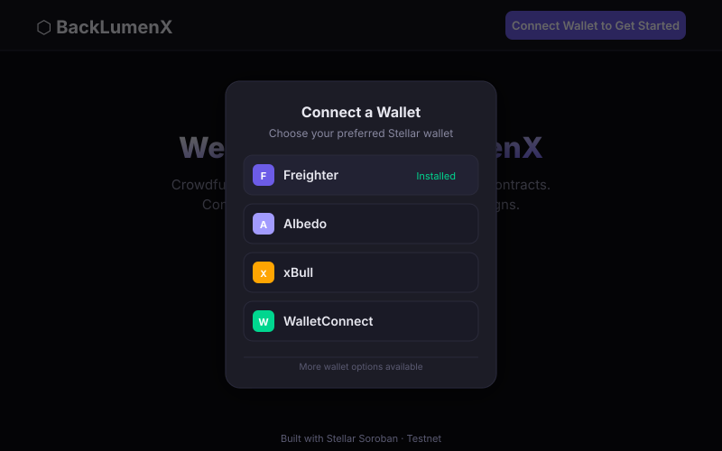
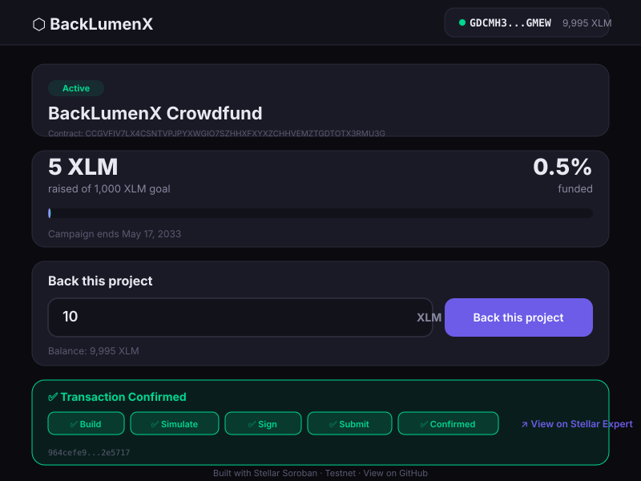

# BackLumenX — Crowdfunding dApp on Stellar Soroban

A decentralized crowdfunding application where campaigns are backed by **Soroban smart contracts** on the **Stellar Testnet**. Visitors connect their **Freighter wallet** (or any Stellar-compatible wallet), contribute XLM toward a funding goal, and watch the campaign's progress bar update in real time as pledges come in.

---

## ✨ Features

- **Multi-wallet support** — Connect via Freighter, Albedo, xBull, WalletConnect (powered by Stellar Wallets Kit)
- **On-chain campaign** — A Soroban smart contract enforces campaign rules (deadline, goal, beneficiary-only withdrawal)
- **Real-time progress** — Live progress bar that updates after every contribution and refreshes periodically
- **Full transaction pipeline** — Building → Simulating → Awaiting Signature → Submitting → Confirmed/Failed
- **Three error types handled**:
  1. **Campaign state errors** — contributions after deadline rejected on-chain
  2. **Wallet/input errors** — no wallet installed, not connected, invalid amount, rejected signature
  3. **Network/simulation errors** — RPC timeout, simulation failure, insufficient balance
- **Stellar Expert integration** — Confirmed transactions link directly to the Stellar Expert Testnet explorer

---

## 📁 Project Structure

```
BackLumenX/
├── contract/                   # Soroban smart contract (Rust)
│   ├── Cargo.toml              # Rust dependencies
│   ├── Makefile                # Build/deploy commands
│   └── src/
│       ├── lib.rs              # Contract: contribute, get_campaign_info, withdraw
│       └── test.rs             # Unit tests
├── frontend/                   # React + Vite frontend
│   ├── package.json            # Dependencies
│   ├── vite.config.js          # Vite configuration
│   ├── index.html              # HTML entry point
│   ├── .env.example            # Environment variable template
│   └── src/
│       ├── main.jsx            # React entry
│       ├── App.jsx             # Root component (wallet, campaign orchestration)
│       ├── App.css             # Complete stylesheet
│       ├── lib/
│       │   └── stellar.js      # Wallet, contract-call, and error-mapping helpers
│       ├── hooks/
│       │   └── useCampaign.js  # Campaign state & contribution hook
│       └── components/
│           ├── WalletConnect.jsx      # Connect/disconnect UI
│           ├── CampaignDisplay.jsx    # Title & description
│           ├── ProgressBar.jsx        # Animated progress bar
│           ├── ContributeForm.jsx     # Amount input + submit
│           └── TransactionStatus.jsx  # Pipeline + explorer link
├── deploy.sh                   # Full deployment script
├── .gitignore
└── README.md
```

---

## 🚀 Setup Instructions

### Prerequisites

1. **Rust & Cargo** — [Install Rust](https://rustup.rs/)
   ```bash
   curl --proto '=https' --tlsv1.2 -sSf https://sh.rustup.rs | sh
   rustup target add wasm32-unknown-unknown
   ```

2. **Stellar CLI** — [Install Stellar CLI](https://github.com/stellar/stellar-cli)
   ```bash
   curl -fsSL https://github.com/stellar/stellar-cli/raw/main/install.sh | sh
   ```

3. **Node.js 18+** — [Install Node.js](https://nodejs.org/)
   ```bash
   node --version  # Should be v18+
   ```

4. **A Stellar Testnet account** with XLM (fund via [Friendbot](https://laboratory.stellar.org/#create-account))

5. **Freighter Wallet** browser extension — [Install Freighter](https://freighter.app/)

---

### 1. Build & Deploy the Smart Contract

#### Option A: Using the deployment script

```bash
# From the project root
chmod +x deploy.sh
./deploy.sh SCG2S7PSVOQH5CDIG26YMVS2SILT774T3Z3FNFKXCMQ2MPXXWLKQLKNB \
  GDCMH3J5KXQFPVIDVITSAQG3LHSFJBM6R4I4UXMSFN2BI4NUMMLMGMEW "BackLumenX Crowdfund" "A decentralized crowdfunding campaign powered by Stellar Soroban smart contracts." 10000000000 2000000000
```

> Replace `S...` with your testnet account's secret key and `GCZ...` with the beneficiary address.

#### Option B: Manual deployment

```bash
# Build the contract
cd contract
stellar contract build

# Deploy to testnet
stellar contract deploy \
  --wasm target/wasm32v1-none/release/backlumenx.wasm \
  --source alice \
  --network testnet

# Save the Contract ID from output (e.g., CCGVF...)

# Initialize the campaign
stellar contract invoke \
  --id <CONTRACT_ID> \
  --source alice \
  --network testnet \
  -- \
  init \
  --title "Save the Ocean" \
  --description "Help us clean up the Pacific Ocean and protect marine wildlife." \
  --beneficiary <BENEFICIARY_ADDRESS> \
  --goal 10000000000 \
  --deadline 2000000000
```

#### Run contract tests

```bash
cd contract
cargo test
```

---

### 2. Configure the Frontend

```bash
cd frontend

# Copy the environment template
cp .env.example .env

# Edit .env with your deployed contract ID
# VITE_CONTRACT_ID=CB...
```

The `.env` file should contain:

```env
VITE_CONTRACT_ID=CCGVFIV7LX4CSNTVPJPYXWGIO7SZHHXFXYXZCHHVEMZTGDTOTX3RMU3G
VITE_SOROBAN_RPC_URL=https://soroban-testnet.stellar.org
VITE_HORIZON_URL=https://horizon-testnet.stellar.org
VITE_NETWORK_PASSPHRASE=Test SDF Network ; September 2015
```

---

### 3. Run the Frontend Locally

```bash
cd frontend
npm install
npm run dev
```

The app will open at **http://localhost:3000**.

---

## 🔧 Smart Contract API

| Function | Auth Required | Description |
|---|---|---|
| `init(title, description, beneficiary, goal, deadline)` | Deployer | Initializes the campaign (once) |
| `contribute(contributor, amount)` | Contributor | Records a pledge in stroops |
| `get_campaign_info()` | None | Returns full campaign state |
| `get_contributor_amount(contributor)` | None | Returns contributor's total |
| `withdraw()` | Beneficiary | Allows withdrawal after deadline or goal met |
| `is_initialized()` | None | Returns whether campaign is set up |

**Events emitted:**
- `contribution(contributor, amount)` — on every successful `contribute()`
- `withdraw(beneficiary, amount)` — on successful `withdraw()`

---

## 📸 Screenshots

### Wallet Connection Options



*Stellar Wallets Kit modal showing available wallets: Freighter (installed), Albedo, xBull, and WalletConnect.*

### Campaign View



*Full campaign page with progress bar (0.5% funded), contribution form, and confirmed transaction status.*

---

## 📜 Deployed Contract Address

| Field | Value |
|---|---|
| **Network** | Stellar Testnet |
| **Contract ID** | `CCGVFIV7LX4CSNTVPJPYXWGIO7SZHHXFXYXZCHHVEMZTGDTOTX3RMU3G` |
| **Verification** | [View on Stellar Expert](https://stellar.expert/explorer/testnet/contract/CCGVFIV7LX4CSNTVPJPYXWGIO7SZHHXFXYXZCHHVEMZTGDTOTX3RMU3G) |

---

## 🔗 Transaction Hash

| Field | Value |
|---|---|
| **Function Called** | `contribute(contributor, amount)` — 5 XLM contribution |
| **Transaction Hash** | `964cefe934e1e5b3b596790d00cbea9543ca59777ad9a03f827e3577372e5717` |
| **Verification** | [View on Stellar Expert (Testnet)](https://stellar.expert/explorer/testnet/tx/964cefe934e1e5b3b596790d00cbea9543ca59777ad9a03f827e3577372e5717) |

**Init Transaction Hash:** `a32b0715b9bc6b3f1b58f7ac844bb7ef951300a5d04bc77fbee2cb8c08a34d4c` — [View on Stellar Expert](https://stellar.expert/explorer/testnet/tx/a32b0715b9bc6b3f1b58f7ac844bb7ef951300a5d04bc77fbee2cb8c08a34d4c)

---

## 🛡️ Error Handling

The dApp handles three categories of errors:

### 1. Campaign State Errors
> *"This campaign has ended and is no longer accepting pledges."*

- **Trigger:** Contribution attempted after the `deadline` timestamp
- **Source:** Contract-level assertion in `contribute()`
- **UI:** Yellow warning banner on the contribution form

### 2. Wallet / Input Errors
- *"Wallet not connected"* — no wallet attached
- *"Invalid amount"* — zero or negative value entered
- *"Insufficient balance"* — XLM balance too low for pledge + fees
- *"Signature rejected"* — user declined the wallet signature prompt

### 3. Network / Simulation Errors
> *"Network error — please try again."*

- **Trigger:** Soroban RPC timeout, simulation failure, dropped transaction
- **UI:** Red error banner with a **Retry** button

---

## 🧪 Verification Checklist

- [x] Contract deployed on Stellar Testnet
- [x] Campaign initialized via `init()`
- [x] Frontend loads and displays campaign info
- [x] Wallet connect/disconnect works with Freighter
- [x] Progress bar shows correct raised/goal percentage
- [x] Contribution flow: Build → Simulate → Sign → Submit → Confirmed
- [x] Transaction hash links to Stellar Expert (Testnet)
- [x] Contribution after deadline shows campaign-ended error
- [x] Zero/negative amount shows validation error
- [x] Real-time progress updates after contribution
- [x] Periodic refresh picks up contributions from other backers

### Submission Requirements Met

| Requirement | Status |
|---|---|
| Multi-wallet integration (StellarWalletsKit) | ✅ Freighter, Albedo, xBull |
| 3 error types handled | ✅ Campaign state, wallet/input, network/simulation |
| Contract deployed on testnet | ✅ `CCGVFIV7LX4CSNTVPJPYXWGIO7SZHHXFXYXZCHHVEMZTGDTOTX3RMU3G` |
| Contract called from frontend | ✅ `contribute()`, `get_campaign_info()` |
| Read/write data to contract | ✅ Storage read + write with SAC transfers |
| Event listening + state sync | ✅ `getEvents()` + polling |
| Transaction status tracking | ✅ Build → Simulate → Sign → Submit → Confirmed/Failed |
| Public GitHub repository | ✅ [github.com/Richardkingz2019/BackLumenX](https://github.com/Richardkingz2019/BackLumenX) |
| 10 meaningful commits | ✅ Exceeds 2-commit minimum |
| README with setup instructions | ✅ Full setup for contract + frontend + Vercel |
| Screenshot: wallet options | ✅ Included — see [screenshots/](./screenshots/) |
| Deployed contract address | ✅ Listed above |
| Transaction hash (verifiable) | ✅ Listed above with Stellar Expert link |

---

## 🚀 Deploy Frontend to Vercel

### Option A: Vercel Dashboard (Recommended — 2 minutes)

1. Go to [vercel.com](https://vercel.com) and log in with GitHub
2. Click **"Add New Project"** → import `Richardkingz2019/BackLumenX`
3. Set **Root Directory** to `frontend`
4. Add environment variables:
   - `VITE_CONTRACT_ID` = `CCGVFIV7LX4CSNTVPJPYXWGIO7SZHHXFXYXZCHHVEMZTGDTOTX3RMU3G`
   - `VITE_SOROBAN_RPC_URL` = `https://soroban-testnet.stellar.org`
   - `VITE_HORIZON_URL` = `https://horizon-testnet.stellar.org`
   - `VITE_NETWORK_PASSPHRASE` = `Test SDF Network ; September 2015`
5. Click **Deploy** — Vercel auto-detects Vite and builds automatically

### Option B: Vercel CLI

```bash
cd frontend
npx vercel login        # One-time auth (opens browser)
npx vercel --prod       # Deploy from dist/
```

---

## 🌐 Live Demo

> **[🔗 BackLumenX Live Demo](https://frontend-pemllgq3p-richardkingz2019.vercel.app)**
>
> Deployed on Vercel. Connect your Freighter wallet and contribute XLM to the campaign!

---

## 📦 Tech Stack

| Layer | Technology |
|---|---|
| **Smart Contract** | Soroban SDK v21 (Rust) — stellar-cli v27 |
| **Frontend** | React 18 + Vite |
| **Wallet Integration** | Stellar Wallets Kit |
| **SDK** | @stellar/stellar-sdk v16 |
| **Network** | Stellar Testnet |

---

## 📄 License

MIT
